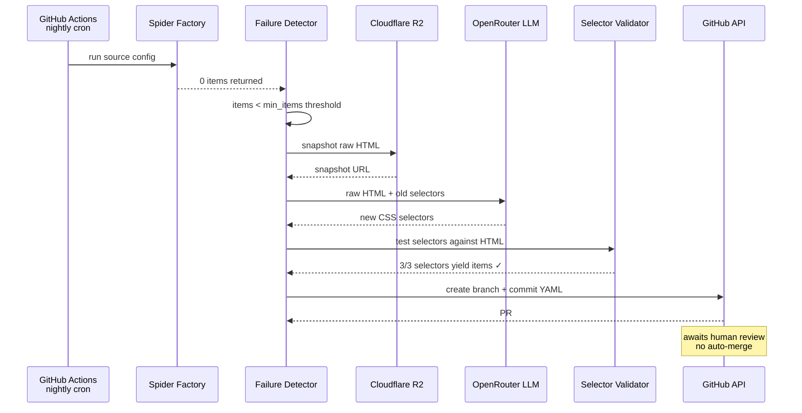
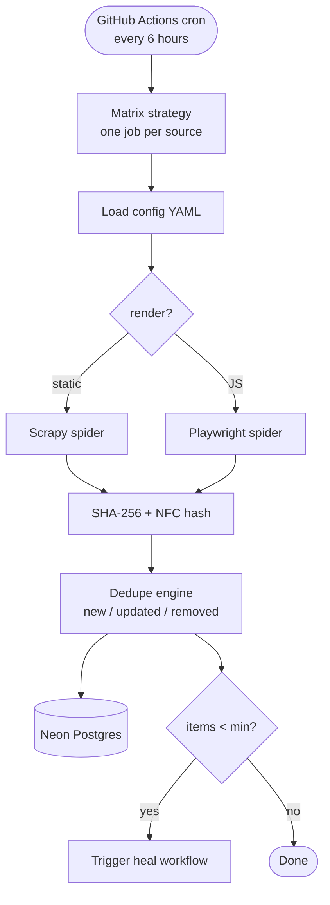
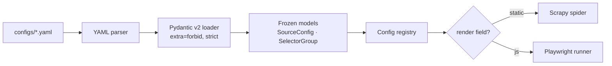

# 🐦‍⬛ `magpie-backend`

> 🔧 **YAML-defined scrapers that self-heal via LLM + PR.**
> One config = one spider. When selectors break, an LLM patches them and opens a pull request.

🌐 [Live API](https://magpie-backend-izzu.onrender.com/health) · 📖 [Why](WHY.md) · 🏗️ [Architecture](docs/ARCHITECTURE.md) · 🎬 [Demo](docs/DEMO.md)


[](https://github.com/Abdul-Muizz1310/magpie-backend/actions/workflows/ci.yml)


---

```console
$ uv run python -m magpie.scrapy.factory configs/hackernews.yaml
[scrapy]     hackernews · static · max_pages=3
[items]      30 items scraped
[hash]       SHA-256 + NFC · 28 new · 2 updated · 0 removed
[persist]    → neon:scrape_items (28 inserts, 2 upserts)

$ uv run python -m magpie.healer configs/demo-broken.yaml
[detect]     demo-broken · 0 items · threshold 1 → HEAL
[snapshot]   raw HTML → R2 scrape/demo-broken/2026-04-13.html
[llm]        openrouter:nemotron-nano · re-deriving selectors…
[validate]   3/3 selectors yield items ✓
[pr]         → github.com/Abdul-Muizz1310/magpie-backend/pull/42
             label: scrape:self-heal · awaiting human review
```

---

## 🎯 Why this exists

Scrapers break constantly. Selectors rot when sites redesign. The usual fix: someone notices days later, debugs manually, ships a patch. **magpie automates the detection-and-fix loop** while keeping humans in the review seat.

- 📝 **One YAML = one spider** — a factory pattern emits Scrapy (static) or Playwright (JS-rendered) from the same config schema
- 🧬 **Self-healing via LLM + PR** — zero items triggers a healer that snapshots raw HTML, re-derives selectors via LLM, validates them, and opens a GitHub PR labeled `scrape:self-heal`
- 🔒 **No auto-merge** — healer PRs require human review, keeping the audit trail readable
- 🔑 **Content-addressed deduplication** — items are SHA-256 hashed with NFC normalization; nightly runs produce diffs (new / updated / removed), not full dumps
- 🛡️ **Strict config validation** — Pydantic v2 with `extra="forbid"` catches YAML typos at load time

---

## ✨ Features

- 🏭 YAML-driven spider factory — static (Scrapy) or JS-rendered (Playwright) from one schema
- 🧬 LLM self-healing pipeline with snapshot → fix → validate → PR workflow
- 🔑 Content-addressed dedup (SHA-256 + NFC normalization)
- 🗄️ Neon Postgres persistence with async SQLAlchemy
- ☁️ Cloudflare R2 for raw HTML snapshots
- 🔎 FastAPI viewer API — 6 endpoints for sources, runs, heals, health
- ⏰ GitHub Actions: CI + nightly scrape (6h cron) + heal-on-failure
- 🧪 135 tests, 100% line coverage, strict Pydantic validation
- 📦 4 shipped configs: hackernews, arxiv-cs, weather-live, demo-broken

---

## 🧠 Self-healing flow



---

## ⏰ Nightly scrape workflow



---

## 🔧 Config validation pipeline



> **Rule:** invalid YAML fails loudly at load time. No config survives past the Pydantic boundary without full validation.

---

## 🏗️ Architecture


See [docs/ARCHITECTURE.md](docs/ARCHITECTURE.md) for the full diagram and directory layout.

---

## 🗂️ Project structure

```
src/magpie/
├── main.py                    # FastAPI viewer app factory
├── factory.py                 # Spider factory — static vs JS dispatch
├── config/
│   ├── loader.py              # YAML → Pydantic v2 config loader
│   ├── registry.py            # Config registry (all sources)
│   └── schema.py              # SourceConfig, SelectorGroup (frozen)
├── core/
│   ├── hashing.py             # SHA-256 + NFC content hashing
│   └── __init__.py
├── scrapy/
│   ├── factory.py             # Scrapy spider builder + runner
│   └── settings.py            # Scrapy settings
├── playwright/
│   └── runner.py              # Playwright JS-rendered spider
├── healer/
│   ├── detector.py            # Zero-item failure detection
│   ├── selector_fixer.py      # LLM selector re-derivation
│   ├── validator.py           # New-selector validation
│   └── github_pr.py           # PR creation (httpx + GitHub REST)
├── storage/
│   ├── db.py                  # async SQLAlchemy engine + session
│   └── repo.py                # Item / run / heal repositories
└── platform/
    ├── health.py              # /health, /version
    ├── logging.py             # Structured logging
    └── middleware.py           # CORS, request ID
```

---

## 🌐 API surface

| Method | Endpoint | Purpose |
|---|---|---|
| `GET` | `/sources` | List all sources with latest status |
| `GET` | `/sources/{name}` | Single source details |
| `GET` | `/runs` | Run history (filterable by source) |
| `GET` | `/heals` | Heal history with PR links |
| `GET` | `/health` | Health check (status + DB connectivity) |
| `GET` | `/version` | Commit SHA |

---

## 📦 Shipped configs

| Config | Type | Description |
|---|---|---|
| `hackernews.yaml` | Static | Hacker News front page, paginated |
| `arxiv-cs.yaml` | Static | arXiv CS recent submissions |
| `weather-live.yaml` | JS-rendered | Live weather dashboard (Playwright) |
| `demo-broken.yaml` | Static | Deliberately broken — triggers healer in demo |

---

## 🛠️ Stack

| Concern | Choice |
|---|---|
| **Config validation** | Pydantic v2 (strict, extra=forbid, frozen models) |
| **Static scraping** | Scrapy + parsel |
| **JS scraping** | Playwright (Python) |
| **Content hashing** | SHA-256 with NFC normalization |
| **Scheduling** | GitHub Actions cron (every 6h) |
| **Storage** | Neon Postgres (async SQLAlchemy) |
| **Artifact storage** | Cloudflare R2 |
| **Healer LLM** | OpenRouter (nvidia/nemotron-nano-9b-v2:free) |
| **GitHub PRs** | httpx + GitHub REST API |
| **Viewer API** | FastAPI |
| **CI** | GitHub Actions (lint + test + Docker build) |

---

## 🚀 Run locally

```bash
# 1. clone & env
git clone https://github.com/Abdul-Muizz1310/magpie-backend.git
cd magpie-backend
cp .env.example .env
# edit: DATABASE_URL, OPENROUTER_API_KEY, R2 creds, GITHUB_TOKEN

# 2. install
uv sync

# 3. run a scrape
uv run python -c "
from magpie.config.loader import load_config_from_file
from magpie.scrapy.factory import run_spider
from pathlib import Path
config = load_config_from_file(Path('configs/hackernews.yaml'))
config = config.model_copy(update={'pagination': {'max_pages': 1}})
items = run_spider(config)
print(f'{len(items)} items scraped')
"

# 4. start viewer API
uv run uvicorn magpie.main:app --reload
# → http://localhost:8000/health
```

---

## 🧪 Testing

```bash
uv run pytest                              # full suite
uv run pytest -m "not slow"               # fast-only (CI)
uv run pytest --cov=src/magpie --cov-report=term-missing
```

| Metric | Value |
|---|---|
| **Test count** | 135 tests |
| **Line coverage** | **100%** |
| **Config validation** | 4 YAML configs, 25 test cases (17 failure modes) |
| **Hashing correctness** | 9 tests including unicode NFC, whitespace normalization |
| **Dedupe accuracy** | 9 integration tests covering new/update/remove/reappear |
| **Healer coverage** | 13 unit tests (detector, validator, LLM fixer, GitHub PR) |
| **CI pipeline** | lint + test + Docker build, ~60s total |

---

## 📐 Engineering philosophy

| Principle | How it shows up |
|---|---|
| 🧪 **Spec-TDD** | 17 failure-mode tests for config validation alone. Healer shipped with detector/validator/fixer/PR tests before implementation. |
| 🛡️ **Negative-space programming** | `extra="forbid"` rejects unknown YAML keys. Frozen models prevent mutation after load. Content hashing normalizes unicode before comparison. |
| 🏗️ **MVC layering** | `platform` (HTTP) + `storage` (data) + `healer`/`scrapy`/`playwright` (business logic). No layer reaches across. |
| 🔤 **Typed everything** | Pydantic v2 strict mode. Frozen config models. No untyped dicts crossing module boundaries. |
| 🌊 **Pure core, imperative shell** | Hashing, dedup logic, config parsing = pure. I/O (DB, R2, GitHub, LLM) at the edges. |

---

## 🚀 Deploy

| Component | Target |
|---|---|
| **Viewer API** | Render free tier at `magpie-backend-izzu.onrender.com` |
| **Scheduled scrapes** | GitHub Actions cron (every 6 hours) |
| **Heal-on-failure** | GitHub Actions `workflow_run` trigger |
| **Raw HTML snapshots** | Cloudflare R2 (`muizz-lab` bucket, `scrape/` prefix) |

---

## 📄 License

MIT. See [LICENSE](LICENSE).

---

> 🐦‍⬛ **`magpie --help`** -- YAML-defined scrapers that fix themselves
