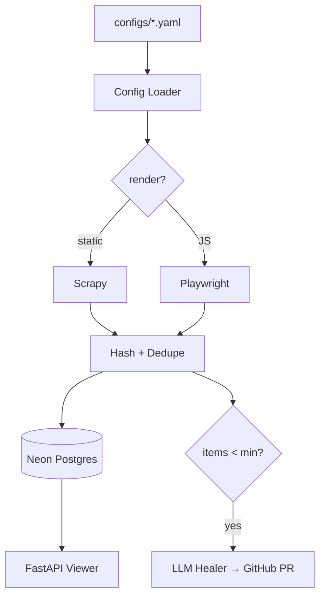

<p align="center">
  
</p>

<h1 align="center">magpie</h1>
<p align="center">
  <em>YAML-defined scrapers that self-heal via LLM + PR</em>
</p>

<p align="center">
  <a href="https://magpie-backend-izzu.onrender.com/health">Live API</a> •
  <a href="WHY.md">Why</a> •
  <a href="docs/ARCHITECTURE.md">Architecture</a> •
  <a href="docs/DEMO.md">Demo Script</a>
</p>

<p align="center">
  
  
</p>

---

## What it does

Define a scraper in 20 lines of YAML. When a selector breaks, an LLM patches it and opens a PR. You review, you merge, you move on.

## The unique angle

- **One YAML = one spider** — factory pattern emits Scrapy (static) or Playwright (JS-rendered) from the same config schema
- **Self-healing via LLM + PR** — zero items triggers a healer that re-derives selectors from raw HTML and opens a GitHub PR labeled `scrape:self-heal`
- **Content-addressed deduplication** — items are SHA-256 hashed; nightly runs produce diffs (new / updated / removed), not full dumps
- **No auto-merge** — healer PRs require human review, keeping the audit trail readable
- **Strict config validation** — Pydantic v2 with `extra="forbid"` catches YAML typos at load time

## Quick start

```bash
git clone https://github.com/Abdul-Muizz1310/magpie-backend.git
cd magpie-backend
cp .env.example .env
uv sync
uv run python -c "
from magpie.config.loader import load_config_from_file
from magpie.scrapy.factory import run_spider
from pathlib import Path
config = load_config_from_file(Path('configs/hackernews.yaml'))
config = config.model_copy(update={'pagination': {'max_pages': 1}})
items = run_spider(config)
print(f'{len(items)} items scraped')
"
```

## Benchmarks

| Metric | Value |
|---|---|
| Config validation | 4 YAML configs, 25 test cases (17 failure modes) |
| Hashing correctness | 9 tests including unicode NFC, whitespace normalization |
| Dedupe accuracy | 9 integration tests covering new/update/remove/reappear |
| Healer coverage | 13 unit tests (detector, validator, LLM fixer, GitHub PR) |
| Test suite | 82 passed, 2 skipped (Playwright), 76% coverage |
| CI pipeline | lint + test + Docker build, ~60s total |

## Architecture



See [docs/ARCHITECTURE.md](docs/ARCHITECTURE.md) for the full diagram and directory layout.

## Tech stack

| Concern | Choice |
|---|---|
| Config validation | Pydantic v2 (strict, extra=forbid) |
| Static scraping | Scrapy + parsel |
| JS scraping | Playwright (Python) |
| Content hashing | SHA-256 with NFC normalization |
| Scheduling | GitHub Actions cron (every 6h) |
| Storage | Neon Postgres (scrape branch) |
| Artifact storage | Cloudflare R2 |
| Healer LLM | OpenRouter (nvidia/nemotron-nano-9b-v2:free) |
| GitHub PRs | httpx + GitHub REST API |
| Viewer API | FastAPI |
| CI | GitHub Actions (lint → test → Docker build) |

## API endpoints

| Method | Path | Description |
|---|---|---|
| GET | `/sources` | List all sources with latest status |
| GET | `/sources/{name}` | Single source details |
| GET | `/runs` | Run history (filterable by source) |
| GET | `/heals` | Heal history with PR links |
| GET | `/health` | Health check (status + DB connectivity) |
| GET | `/version` | Commit SHA |

## Shipped configs

| Config | Type | Description |
|---|---|---|
| `hackernews.yaml` | Static | Hacker News front page, paginated |
| `arxiv-cs.yaml` | Static | arXiv CS recent submissions |
| `weather-live.yaml` | JS-rendered | Live weather dashboard (Playwright) |
| `demo-broken.yaml` | Static | Deliberately broken — triggers healer in demo |

## Deployment

- **Viewer API**: Render free tier at `magpie-backend-izzu.onrender.com`
- **Scheduled scrapes**: GitHub Actions cron (every 6 hours)
- **Heal-on-failure**: GitHub Actions workflow_run trigger
- **Raw HTML snapshots**: Cloudflare R2 (`muizz-lab` bucket, `scrape/` prefix)

## License

MIT
