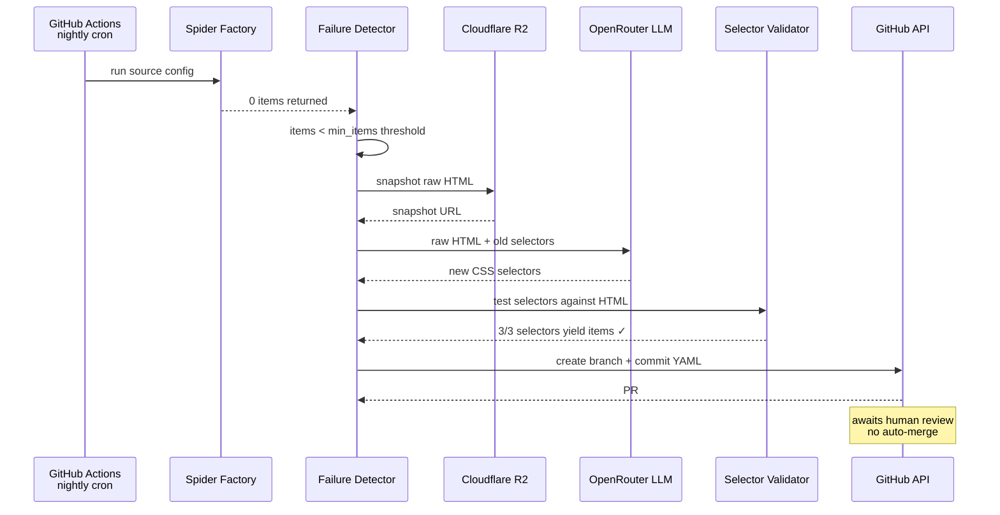
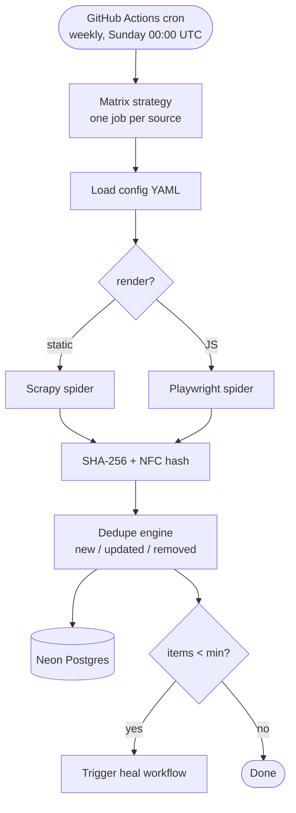
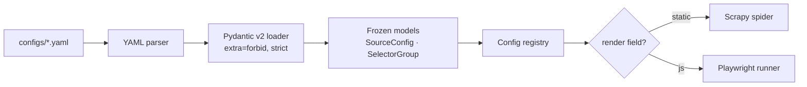
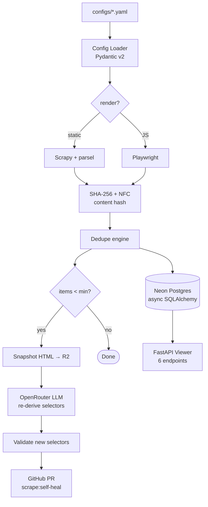

# 🐦‍⬛ `magpie-backend`

> 🔧 **YAML-defined scrapers that self-heal via LLM + PR.**
> One config = one spider. When selectors break, an LLM patches them and opens a pull request.

🌐 [Live API](https://magpie-backend-izzu.onrender.com/health) · 📖 [Why](WHY.md) · 🏗️ [Architecture](docs/ARCHITECTURE.md) · 🎬 [Demo](docs/DEMO.md)


[](https://github.com/Abdul-Muizz1310/magpie-backend/actions/workflows/ci.yml)


---

```console
$ uv run magpie migrate                           # apply Alembic schema
$ uv run magpie run hackernews                    # one scrape, sync
[scrapy]   hackernews · static · max_pages=3
[items]    30 items scraped
[hash]     SHA-256 + NFC · 28 new · 2 updated · 0 removed
[persist]  → neon:items (28 inserts, 2 upserts)

$ curl -s -X POST localhost:8000/api/scrape/hackernews/enqueue
{ "run_id": "...", "job_id": "42", "source": "hackernews", "status": "queued" }

# When a selector breaks:
[detect]   huggingface-papers · 0 items · threshold 5 → HEAL
[fetch]    raw HTML (post-302 redirect) via httpx
[llm]      openrouter:... · re-deriving container + field selectors…
[validate] 2/2 selectors yield items ✓
[pr]       → github.com/Abdul-Muizz1310/magpie-backend/pull/N (file-origin)
              OR sources.config_yaml updated in place (api-origin)
```

---

## 🎯 Why this exists

Scrapers break constantly. Selectors rot when sites redesign. The usual fix: someone notices days later, debugs manually, ships a patch. **magpie automates the detection-and-fix loop** while keeping humans in the review seat.

- 📝 **One YAML = one spider** — a factory pattern emits Scrapy (static) or Playwright (JS-rendered) from the same config schema; CSS **and** XPath selectors are both supported per-field.
- 🧬 **Self-healing via LLM + PR or in-place patch** — zero items (or a dead container selector) triggers a healer that re-fetches HTML, re-derives selectors via an LLM, validates them, and either opens a GitHub PR (for file-origin configs) or writes the fix directly to Postgres (for api-origin configs).
- 🔒 **No auto-merge for file-origin heals** — PRs labeled `scrape:self-heal` require human review.
- 🔑 **Content-addressed deduplication** — items are SHA-256 hashed with NFC normalization; runs produce diffs (new / updated / removed), not full dumps.
- 🛡️ **Strict config validation** — Pydantic v2 with `extra="forbid"` + compiled selector checks; typos and broken selectors fail at submit time, not at scrape time.
- ⚙️ **Async task queue** — scrapes run via Procrastinate (Postgres-backed) with retry + exponential backoff; a stale-run reaper cleans up after worker crashes.

---

## ✨ Features

- 🏭 YAML-driven spider factory — static (Scrapy) or JS-rendered (Playwright) from one schema, CSS or XPath per field.
- 🧬 LLM self-healing pipeline (detect → re-fetch → fix → validate → apply) with dual modes: PR for committed configs, in-place DB patch for runtime ones.
- 🔑 Content-addressed dedup (SHA-256 + NFC normalization).
- 🗄️ Neon Postgres persistence with async SQLAlchemy + Alembic migrations.
- 🧵 Async task queue (Procrastinate) embedded in the FastAPI lifespan; no separate worker service required on Render's free tier.
- 🔎 FastAPI API — viewer endpoints (`/sources`, `/runs`, `/heals`) + custom-source CRUD (`/api/sources`) + async enqueue (`/api/scrape/{source}/enqueue`).
- ⏰ GitHub Actions: CI + weekly scrape (Sundays 00:00 UTC) + heal-on-failure.
- 🧪 270+ tests, mypy strict, ruff clean.
- 📦 7 shipped configs: hackernews, arxiv-cs, lobsters, huggingface-papers, github-trending, producthunt-today, wikipedia-current-events.

---

## 🧠 Self-healing flow



---

## ⏰ Nightly scrape workflow



---

## 🔧 Config validation pipeline



> **Rule:** invalid YAML fails loudly at load time. No config survives past the Pydantic boundary without full validation.

---

## 🏗️ Architecture



See [docs/ARCHITECTURE.md](docs/ARCHITECTURE.md) for the full diagram and directory layout.

---

## 🗂️ Project structure

```
src/magpie/
├── main.py                    # FastAPI app — routers + lifespan
├── lifespan.py                # File-source sync + embedded Procrastinate worker
├── cli.py                     # `magpie` CLI (migrate | sync | run | run-all)
├── factory.py                 # Spider factory — static vs JS dispatch
├── api/
│   ├── deps.py                # Depends() for session / session_factory
│   └── routers/
│       ├── scrape.py          # POST /api/scrape/{source}/once + /batch
│       ├── jobs.py            # POST /api/scrape/{source}/enqueue, GET /api/runs/{id}
│       ├── sources.py         # CRUD at /api/sources
│       └── viewer.py          # /sources, /runs, /heals (frontend)
├── services/
│   └── scrape_service.py      # Orchestrates scrape → persist → return
├── queue/
│   ├── app.py                 # Procrastinate App (Postgres connector)
│   └── tasks.py               # scrape_source, heal_source, reap_stale_runs
├── healer/
│   ├── apply.py               # Heal orchestrator (container + field level)
│   ├── detector.py            # Zero-item failure detection
│   ├── selector_fixer.py      # LLM selector re-derivation
│   ├── validator.py           # New-selector validation
│   ├── github_pr.py           # PR creation (httpx + GitHub REST)
│   └── run.py                 # `magpie-heal` CLI entrypoint
├── storage/
│   ├── db.py                  # Async SQLAlchemy engine + session factory
│   ├── models.py              # ORM: Source, Run, Item, Heal
│   ├── sources_repo.py        # Source CRUD
│   ├── items_repo_pg.py       # Item persistence with dedup accounting
│   ├── runs_repo_pg.py        # Run state transitions + reaper
│   ├── heals_repo.py          # Heal records
│   └── repo.py                # In-memory ItemRepository (tests only)
├── config/
│   ├── loader.py              # YAML → Pydantic v2 config loader
│   ├── registry.py            # Config registry (all sources)
│   └── schema.py              # SourceConfig + selector compile-check
├── schemas/
│   ├── scrape.py              # ScrapeOnceRequest / ScrapeResult
│   ├── jobs.py                # EnqueueResponse / RunView
│   └── sources.py             # SourceSubmission / SourceDetail
├── scrapy/
│   ├── factory.py             # Scrapy spider builder + httpx runner
│   └── settings.py            # Scrapy settings
├── playwright/
│   └── runner.py              # Playwright JS-rendered spider
├── core/
│   └── hashing.py             # SHA-256 + NFC content hashing
└── platform/
    ├── health.py              # /health (503 on DB down), /version
    ├── logging.py             # Structured logging
    └── middleware.py          # CORS, request ID

alembic/                       # Migrations
docker-entrypoint.sh           # alembic upgrade + procrastinate schema --apply
Dockerfile                     # Image with chromium + non-root user + HEALTHCHECK
```

---

## 🌐 API surface

### Viewer (frontend-facing)

| Method | Endpoint | Purpose |
|---|---|---|
| `GET` | `/sources` | List all sources with latest status |
| `GET` | `/sources/{name}` | Single source details |
| `GET` | `/runs` | Run history (filterable by source) |
| `GET` | `/heals` | Heal history with PR links |
| `GET` | `/health` | Health check (200 OK, **503 when DB is down**) |
| `GET` | `/version` | Commit SHA |

### Custom sources (runtime config management)

| Method | Endpoint | Purpose |
|---|---|---|
| `POST` | `/api/sources` | Submit a new source (YAML or JSON) — `origin=api` |
| `GET` | `/api/sources` | List sources (filter by `origin=file|api`) |
| `GET` | `/api/sources/{name}` | Source detail including full YAML |
| `PATCH` | `/api/sources/{name}` | Update (api-origin only) |
| `DELETE` | `/api/sources/{name}` | Delete (api-origin only) |

### Scraping

| Method | Endpoint | Purpose |
|---|---|---|
| `POST` | `/api/scrape/{source}/once` | Run sync, returns items immediately |
| `POST` | `/api/scrape/batch` | Run multiple sources concurrently (sync) |
| `POST` | `/api/scrape/{source}/enqueue` | Defer to the worker, returns `run_id` |
| `GET` | `/api/runs/{run_id}` | Poll queued/running/ok/error status |

---

## 📦 Shipped configs

| Config | Type | Description |
|---|---|---|
| `hackernews.yaml` | Static (CSS) | Hacker News front page, paginated |
| `arxiv-cs.yaml` | Static (CSS) | arXiv CS recent submissions |
| `lobsters.yaml` | Static (CSS) | Lobste.rs front page |
| `huggingface-papers.yaml` | Static (CSS) | Daily AI papers |
| `github-trending.yaml` | Static (CSS) | Trending repos |
| `producthunt-today.yaml` | JS (Playwright) | Today's launches |
| `wikipedia-current-events.yaml` | Static (**XPath**) | News bullets — XPath selector demo |

---

## 🛠️ Stack

| Concern | Choice |
|---|---|
| **Config validation** | Pydantic v2 (strict, extra=forbid, compiled selectors) |
| **Static scraping** | httpx + parsel (CSS / XPath) |
| **JS scraping** | Playwright (Python) with polite UA + soft `wait_for` timeout |
| **Task queue** | Procrastinate (Postgres broker, async, embedded worker) |
| **Persistence** | Neon Postgres + async SQLAlchemy + Alembic |
| **Content hashing** | SHA-256 with NFC normalization |
| **Scheduling** | GitHub Actions weekly cron (Sunday 00:00 UTC) |
| **Artifact storage** | Cloudflare R2 (future — not yet wired for snapshots) |
| **Healer LLM** | OpenRouter (configurable model via `OPENROUTER_MODEL_PRIMARY`) |
| **GitHub PRs** | httpx + GitHub REST API (idempotent per `heal/{source}` branch) |
| **API framework** | FastAPI |
| **CI** | GitHub Actions (lint + test with PG service + Docker build), uv cached |

---

## 🚀 Run locally

```bash
# 1. clone & env
git clone https://github.com/Abdul-Muizz1310/magpie-backend.git
cd magpie-backend
cp .env.example .env
# edit: DATABASE_URL (Neon), OPENROUTER_API_KEY, GITHUB_PAT_SCRAPE_HEALER

# 2. install + browsers
uv sync
uv run playwright install chromium

# 3. migrate + sync file configs into the DB
uv run magpie migrate
uv run magpie sync

# 4. run a scrape (sync, no worker required)
uv run magpie run hackernews
# ok: source=hackernews run_id=... items=30

# 5. start the API + embedded worker
uv run uvicorn magpie.main:app --reload
# → http://localhost:8000/health
# → http://localhost:8000/sources
```

---

## 🧪 Testing

```bash
uv run pytest                              # full suite
uv run pytest -m "not slow"               # fast-only (CI)
uv run pytest --cov=src/magpie --cov-report=term-missing
```

| Metric | Value |
|---|---|
| **Test count** | 270+ tests |
| **Type discipline** | mypy strict clean, no `Any` leaking across module boundaries |
| **Linting** | ruff check + ruff format clean |
| **Config validation** | 35 tests (XPath, CSS, selector compile-check, cross-field validators) |
| **Dedup accuracy** | in-memory + Postgres repos both cover new/update/remove/reappear |
| **Healer coverage** | container heal + field heal, file-origin PR + api-origin db-patch |
| **CI pipeline** | lint + test (against real Postgres service) + Docker build |

---

## 📐 Engineering philosophy

| Principle | How it shows up |
|---|---|
| 🧪 **Spec-TDD** | 17 failure-mode tests for config validation alone. Healer shipped with detector/validator/fixer/PR tests before implementation. |
| 🛡️ **Negative-space programming** | `extra="forbid"` rejects unknown YAML keys. Frozen models prevent mutation after load. Content hashing normalizes unicode before comparison. |
| 🏗️ **MVC layering** | `platform` (HTTP) + `storage` (data) + `healer`/`scrapy`/`playwright` (business logic). No layer reaches across. |
| 🔤 **Typed everything** | Pydantic v2 strict mode. Frozen config models. No untyped dicts crossing module boundaries. |
| 🌊 **Pure core, imperative shell** | Hashing, dedup logic, config parsing = pure. I/O (DB, R2, GitHub, LLM) at the edges. |

---

## 🚀 Deploy

| Component | Target |
|---|---|
| **Viewer API** | Render free tier at `magpie-backend-izzu.onrender.com` |
| **Scheduled scrapes** | GitHub Actions cron (every 6 hours) |
| **Heal-on-failure** | GitHub Actions `workflow_run` trigger |
| **Raw HTML snapshots** | Cloudflare R2 (`muizz-lab` bucket, `scrape/` prefix) |

---

## 📄 License

MIT. See [LICENSE](LICENSE).

---

> 🐦‍⬛ **`magpie --help`** -- YAML-defined scrapers that fix themselves
