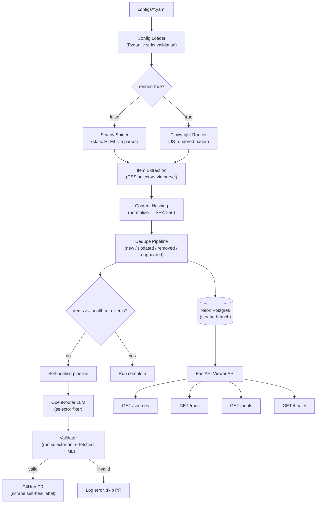
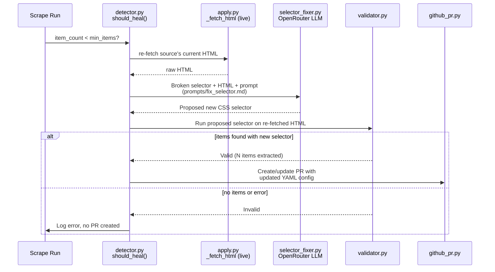
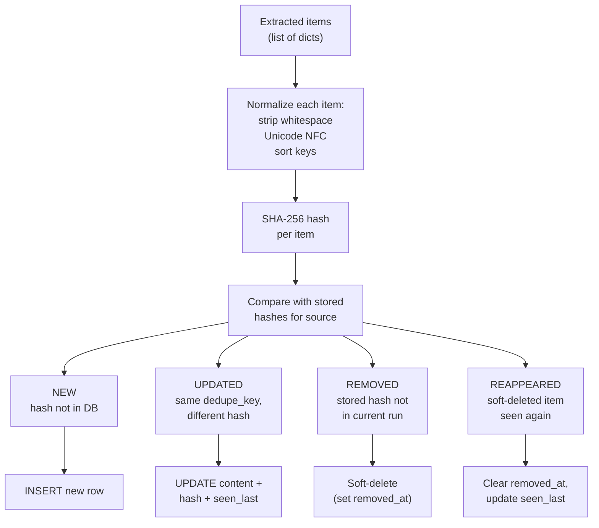
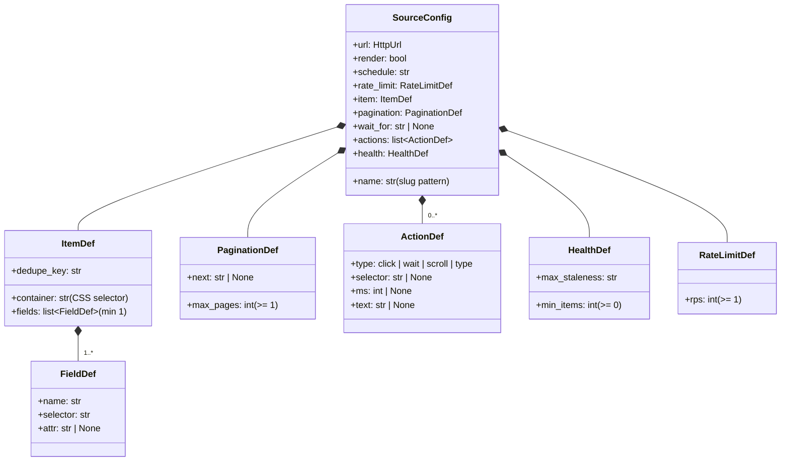

# Architecture

## Overview

magpie is a config-driven scraping framework. A YAML file defines what to scrape; the framework handles how. When selectors break, an LLM proposes fixes via GitHub PR.

## System diagram



## Self-healing pipeline

When a scrape run returns fewer items than `health.min_items`, the healer activates. It re-fetches the source's current HTML (`healer/apply.py:_fetch_html` — Playwright for JS-rendered sources, `httpx` otherwise) so the LLM proposes fixes against the live page structure. (Archiving the exact pre-parse HTML to R2 — so the healer sees what the scraper saw rather than a later fetch — is future work; see the storage note below.)



## Deduplication flow

Each extracted item is normalized and hashed. The hash is compared against stored hashes for the same source to classify items into four categories.



## Config schema hierarchy

All YAML configs are validated through a strict Pydantic model tree. `extra="forbid"` on every model catches typos at load time.



## Directory structure

```
src/magpie/
├── config/
│   ├── schema.py          # Pydantic models: SourceConfig, ItemDef, etc.
│   ├── loader.py          # YAML string/file → SourceConfig
│   └── registry.py        # Discover all configs/*.yaml
├── core/
│   └── hashing.py         # Deterministic SHA-256 with normalization
├── factory.py             # Dispatch: render=false → Scrapy, render=true → Playwright
├── scrapy/
│   ├── factory.py         # Build Spider class + run_spider() with pagination
│   └── settings.py        # Default Scrapy settings
├── playwright/
│   └── runner.py          # JS-rendered page scraping via Playwright
├── healer/
│   ├── detector.py        # should_heal() threshold check
│   ├── selector_fixer.py  # LLM call to fix broken selectors
│   ├── validator.py       # Run proposed selector on re-fetched HTML
│   ├── github_pr.py       # Create/update heal PRs
│   └── prompts/
│       └── fix_selector.md
├── storage/
│   ├── db.py              # SQLAlchemy async engine
│   └── repo.py            # ItemRepository with dedupe logic
└── main.py                # FastAPI viewer API
```

## Data flow

1. **Load** -- YAML config validated into `SourceConfig` via Pydantic (strict, extra=forbid)
2. **Dispatch** -- Factory checks `render` flag, returns Scrapy spider class or PlaywrightRunner
3. **Extract** -- CSS selectors applied to HTML via parsel; items collected as dicts
4. **Hash** -- Each item normalized (whitespace stripped, Unicode NFC, keys sorted) and SHA-256 hashed
5. **Dedupe** -- Compare hashes against DB; classify as new / updated / removed / reappeared
6. **Persist** -- Upsert items, update `seen_last`, soft-delete removed items
7. **Heal** -- If `item_count < health.min_items`, healer fires: it re-fetches the source's current HTML, the LLM proposes a new selector, the validator checks it against that HTML, and a GitHub PR is opened if valid

## Key design decisions

| Decision | Why |
|---|---|
| parsel for extraction (not Scrapy internals) | Enables `run_spider()` to work without Twisted reactor, making tests reliable |
| In-memory `ItemRepository` | Allows unit testing without DB; swap to SQLAlchemy for production |
| No auto-merge on heal PRs | Audit trail > convenience; broken selectors need human review |
| File-based LLM prompts | Prompts in `prompts/*.md` with frontmatter, not inline strings |
| `extra="forbid"` on all Pydantic models | Catches typos in YAML configs at load time |
| Healer re-fetches HTML live (R2 archive is future) | Keeps the healer dependency-free today; archiving the exact pre-parse snapshot to R2 — so it sees what the scraper saw, not a later fetch — is the planned upgrade |
| SHA-256 per item (not page) | Detects partial changes; one updated listing doesn't invalidate the whole run |
