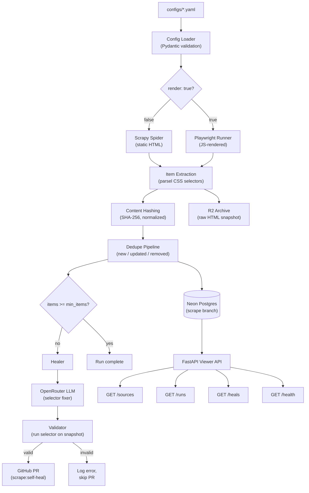

# Architecture

## Overview

magpie is a config-driven scraping framework. A YAML file defines what to scrape; the framework handles how. When selectors break, an LLM proposes fixes via GitHub PR.

## System diagram



## Directory structure

```
src/magpie/
├── config/
│   ├── schema.py          # Pydantic models: SourceConfig, ItemDef, etc.
│   ├── loader.py          # YAML string/file → SourceConfig
│   └── registry.py        # Discover all configs/*.yaml
├── core/
│   └── hashing.py         # Deterministic SHA-256 with normalization
├── factory.py             # Dispatch: render=false → Scrapy, render=true → Playwright
├── scrapy/
│   ├── factory.py         # Build Spider class + run_spider() with pagination
│   └── settings.py        # Default Scrapy settings
├── playwright/
│   └── runner.py          # JS-rendered page scraping via Playwright
├── healer/
│   ├── detector.py        # should_heal() threshold check
│   ├── selector_fixer.py  # LLM call to fix broken selectors
│   ├── validator.py       # Run proposed selector on HTML snapshot
│   ├── github_pr.py       # Create/update heal PRs
│   └── prompts/
│       └── fix_selector.md
├── storage/
│   ├── db.py              # SQLAlchemy async engine
│   └── repo.py            # ItemRepository with dedupe logic
└── main.py                # FastAPI viewer API
```

## Data flow

1. **Load** — YAML config validated into `SourceConfig` via Pydantic (strict, extra=forbid)
2. **Dispatch** — Factory checks `render` flag, returns Scrapy spider class or PlaywrightRunner
3. **Extract** — CSS selectors applied to HTML via parsel; items collected as dicts
4. **Archive** — Raw HTML snapshot saved to R2 before parsing (healer needs this)
5. **Hash** — Each item normalized (whitespace stripped, unicode NFC, keys sorted) and SHA-256 hashed
6. **Dedupe** — Compare hashes against DB; classify as new / updated / removed
7. **Persist** — Upsert items, update `seen_last`, soft-delete removed items
8. **Heal** — If `item_count < health.min_items`, healer fires: LLM proposes new selector, validator checks it against the snapshot, and a GitHub PR is opened if valid

## Key design decisions

| Decision | Why |
|---|---|
| parsel for extraction (not Scrapy internals) | Enables `run_spider()` to work without Twisted reactor, making tests reliable |
| In-memory `ItemRepository` | Allows unit testing without DB; swap to SQLAlchemy for production |
| No auto-merge on heal PRs | Audit trail > convenience; broken selectors need human review |
| File-based LLM prompts | Prompts in `prompts/*.md` with frontmatter, not inline strings |
| `extra="forbid"` on all Pydantic models | Catches typos in YAML configs at load time |
