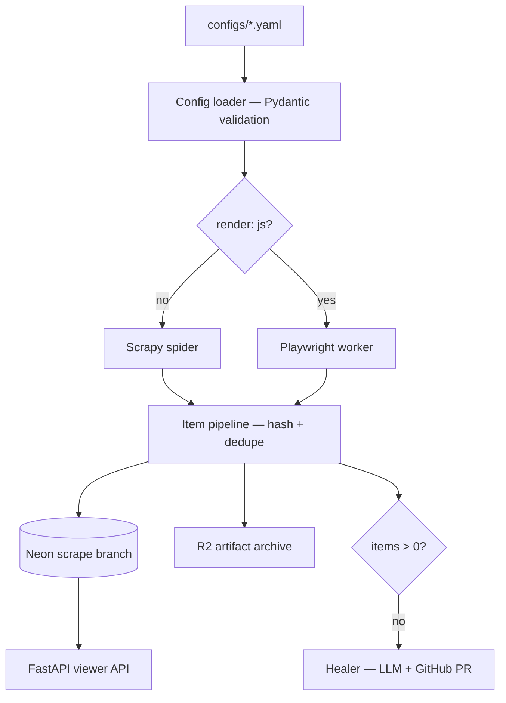

# Architecture

## Components

| Component | Responsibility |
|---|---|
| Config loader | Validates YAML against Pydantic schema |
| Factory | Dispatches to Scrapy or Playwright based on `render` flag |
| Item pipeline | Hashes items, deduplicates against DB, persists |
| Archive | Stores raw HTML snapshots in R2 for healer |
| Healer | Detects broken selectors, asks LLM for fix, opens PR |
| Viewer API | FastAPI endpoints: `/sources`, `/runs`, `/heals` |
