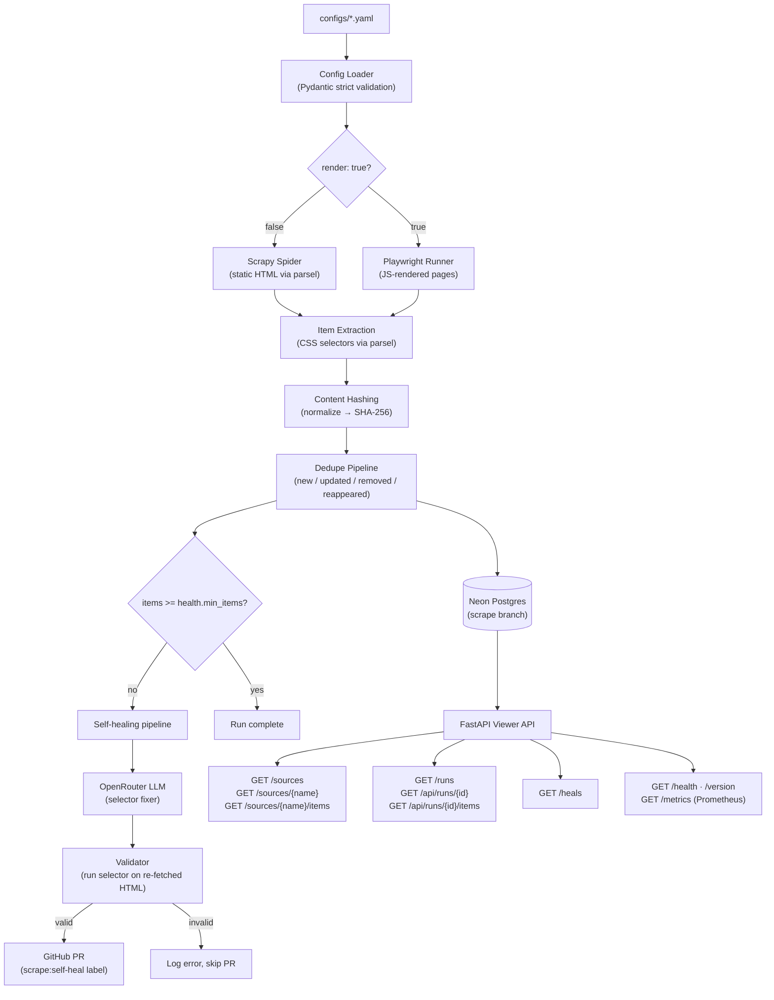
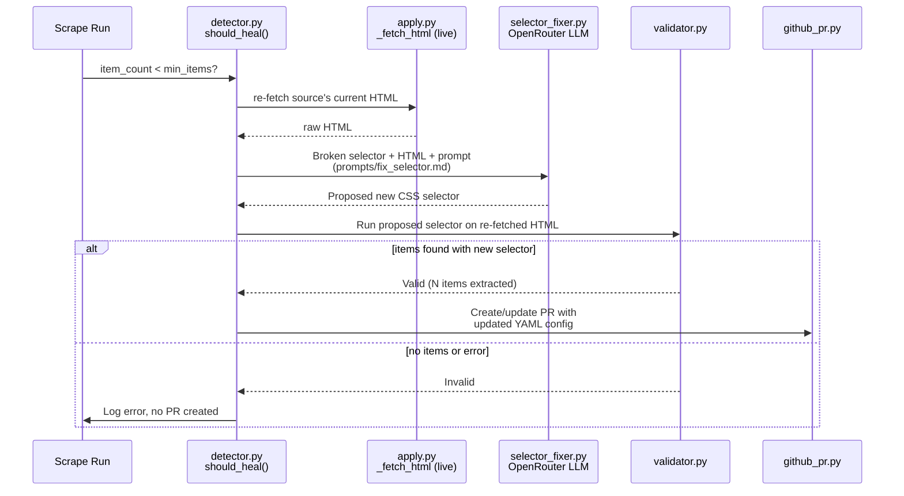
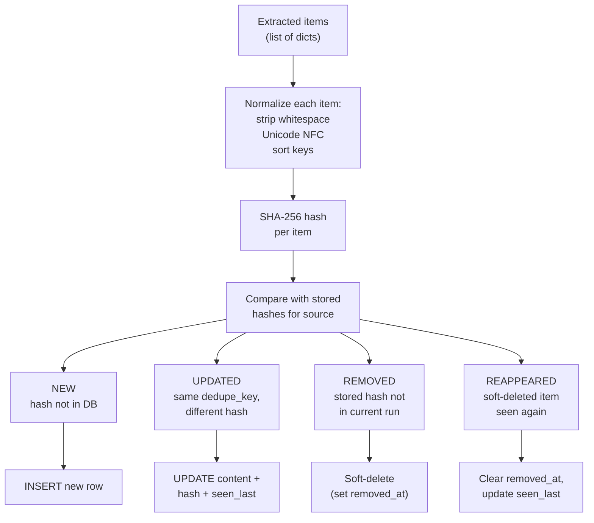
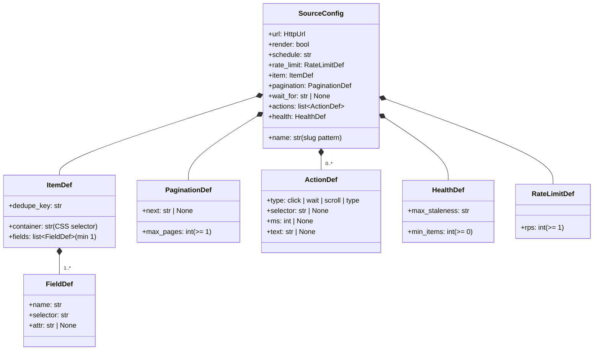

# Architecture

## Overview

magpie is a config-driven scraping framework. A YAML file defines what to scrape; the framework handles how. When selectors break, an LLM proposes fixes via GitHub PR.

## System diagram


```mermaid
flowchart TD
    YAML["configs/*.yaml"] --> Loader["Config Loader<br/>(Pydantic strict validation)"]
    Loader --> Factory{"render: true?"}
    Factory -- "false" --> Scrapy["Scrapy Spider<br/>(static HTML via parsel)"]
    Factory -- "true" --> PW["Playwright Runner<br/>(JS-rendered pages)"]
    Scrapy --> Extract["Item Extraction<br/>(CSS selectors via parsel)"]
    PW --> Extract
    Extract --> Hash["Content Hashing<br/>(normalize → SHA-256)"]
    Hash --> Dedupe["Dedupe Pipeline<br/>(new / updated / removed / reappeared)"]
    Dedupe --> DB[("Neon Postgres<br/>(scrape branch)")]
    Dedupe --> Check{"items >= health.min_items?"}
    Check -- "no" --> Healer["Self-healing pipeline"]
    Check -- "yes" --> Done["Run complete"]
    Healer --> LLM["OpenRouter LLM<br/>(selector fixer)"]
    LLM --> Validate["Validator<br/>(run selector on re-fetched HTML)"]
    Validate -- "valid" --> PR["GitHub PR<br/>(scrape:self-heal label)"]
    Validate -- "invalid" --> Log["Log error, skip PR"]
    DB --> API["FastAPI Viewer API"]
    API --> Sources["GET /sources<br/>GET /sources/{name}<br/>GET /sources/{name}/items"]
    API --> Runs["GET /runs<br/>GET /api/runs/{id}<br/>GET /api/runs/{id}/items"]
    API --> Heals["GET /heals"]
    API --> Health["GET /health · /version<br/>GET /metrics (Prometheus)"]
```

## Self-healing pipeline

When a scrape run returns fewer items than `health.min_items`, the healer activates. It re-fetches the source's current HTML (`healer/apply.py:_fetch_html` — Playwright for JS-rendered sources, `httpx` otherwise) so the LLM proposes fixes against the live page structure. (Archiving the exact pre-parse HTML to R2 — so the healer sees what the scraper saw rather than a later fetch — is future work; see the storage note below.)


```mermaid
sequenceDiagram
    participant Run as Scrape Run
    participant Det as detector.py<br/>should_heal()
    participant Fetch as apply.py<br/>_fetch_html (live)
    participant LLM as selector_fixer.py<br/>OpenRouter LLM
    participant Val as validator.py
    participant GH as github_pr.py

    Run->>Det: item_count < min_items?
    Det->>Fetch: re-fetch source's current HTML
    Fetch-->>Det: raw HTML
    Det->>LLM: Broken selector + HTML + prompt<br/>(prompts/fix_selector.md)
    LLM-->>Det: Proposed new CSS selector
    Det->>Val: Run proposed selector on re-fetched HTML
    alt items found with new selector
        Val-->>Det: Valid (N items extracted)
        Det->>GH: Create/update PR with<br/>updated YAML config
    else no items or error
        Val-->>Det: Invalid
        Det->>Run: Log error, no PR created
    end
```

## Deduplication flow

Each extracted item is normalized and hashed. The hash is compared against stored hashes for the same source to classify items into four categories.


```mermaid
flowchart TD
    Items["Extracted items<br/>(list of dicts)"] --> Normalize["Normalize each item:<br/>strip whitespace<br/>Unicode NFC<br/>sort keys"]
    Normalize --> Hash["SHA-256 hash<br/>per item"]
    Hash --> Compare["Compare with stored<br/>hashes for source"]
    Compare --> New["NEW<br/>hash not in DB"]
    Compare --> Updated["UPDATED<br/>same dedupe_key,<br/>different hash"]
    Compare --> Removed["REMOVED<br/>stored hash not<br/>in current run"]
    Compare --> Reappeared["REAPPEARED<br/>soft-deleted item<br/>seen again"]
    New --> Upsert["INSERT new row"]
    Updated --> Upsert2["UPDATE content +<br/>hash + seen_last"]
    Removed --> Soft["Soft-delete<br/>(set removed_at)"]
    Reappeared --> Restore["Clear removed_at,<br/>update seen_last"]
```

## Config schema hierarchy

All YAML configs are validated through a strict Pydantic model tree. `extra="forbid"` on every model catches typos at load time.


```mermaid
classDiagram
    class SourceConfig {
        +name: str (slug pattern)
        +url: HttpUrl
        +render: bool
        +schedule: str
        +rate_limit: RateLimitDef
        +item: ItemDef
        +pagination: PaginationDef
        +wait_for: str | None
        +actions: list~ActionDef~
        +health: HealthDef
    }
    class ItemDef {
        +container: str (CSS selector)
        +fields: list~FieldDef~ (min 1)
        +dedupe_key: str
    }
    class FieldDef {
        +name: str
        +selector: str
        +attr: str | None
    }
    class PaginationDef {
        +next: str | None
        +max_pages: int (>= 1)
    }
    class ActionDef {
        +type: click | wait | scroll | type
        +selector: str | None
        +ms: int | None
        +text: str | None
    }
    class HealthDef {
        +min_items: int (>= 0)
        +max_staleness: str
    }
    class RateLimitDef {
        +rps: int (>= 1)
    }

    SourceConfig *-- ItemDef
    SourceConfig *-- PaginationDef
    SourceConfig *-- HealthDef
    SourceConfig *-- RateLimitDef
    SourceConfig *-- "0..*" ActionDef
    ItemDef *-- "1..*" FieldDef
```

## Directory structure

```
src/magpie/
├── main.py                    # FastAPI app — routers + lifespan
├── lifespan.py                # File-source sync + embedded Procrastinate worker
├── cli.py                     # `magpie` CLI (migrate | sync | run | run-all | due)
├── factory.py                 # Spider factory — static vs JS dispatch
├── paths.py                   # Repo/config path resolution
├── scheduling.py              # Per-source cron evaluation for `magpie due`
├── api/
│   ├── deps.py                # Depends() for session / session_factory
│   ├── items_view.py          # Item row → API view (URL resolution)
│   └── routers/
│       ├── scrape.py          # POST /api/scrape/{source}/once + /batch
│       ├── jobs.py            # POST /api/scrape/{source}/enqueue, GET /api/runs/{id}(/items)
│       ├── sources.py         # CRUD at /api/sources
│       └── viewer.py          # /sources, /sources/{name}(/items), /runs, /heals
├── services/
│   └── scrape_service.py      # Orchestrates scrape → persist → return
├── queue/
│   ├── app.py                 # Procrastinate App (Postgres connector)
│   └── tasks.py               # scrape_source, heal_source, reap_stale_runs
├── healer/
│   ├── apply.py               # Heal orchestrator (container + field level)
│   ├── detector.py            # should_heal() threshold check
│   ├── selector_fixer.py      # LLM selector re-derivation (OpenRouter)
│   ├── validator.py           # New-selector validation
│   ├── github_pr.py           # PR creation (httpx + GitHub REST)
│   ├── run.py                 # `magpie-heal` CLI entrypoint
│   └── prompts/
│       └── fix_selector.md
├── evals/
│   ├── heal_rate.py           # Heal-rate eval driver (spec 07)
│   ├── offline_proposer.py    # Network-free, value-anchored selector re-derivation
│   └── cli.py                 # `magpie-eval` entrypoint
├── storage/
│   ├── db.py                  # Async SQLAlchemy engine + session factory
│   ├── models.py              # ORM: Source, Run, Item, Heal
│   ├── sources_repo.py        # Source CRUD
│   ├── items_repo_pg.py       # Item persistence with dedup accounting
│   ├── runs_repo_pg.py        # Run state transitions + reaper
│   ├── heals_repo.py          # Heal records
│   └── repo.py                # In-memory ItemRepository (tests only)
├── config/
│   ├── loader.py              # YAML → Pydantic v2 config loader
│   ├── registry.py            # Config registry (all sources)
│   └── schema.py              # SourceConfig + selector compile-check
├── schemas/
│   ├── scrape.py              # ScrapeOnceRequest / ScrapeResult
│   ├── jobs.py                # EnqueueResponse / RunView
│   └── sources.py             # SourceSubmission / SourceDetail
├── scrapy/
│   ├── factory.py             # Scrapy spider builder + httpx runner
│   └── settings.py            # Scrapy settings
├── playwright/
│   └── runner.py              # Playwright JS-rendered spider
├── core/
│   ├── hashing.py             # SHA-256 + NFC content hashing
│   └── safe_fetch.py          # SSRF-guarded httpx GET (redirects re-validated)
└── platform/
    ├── health.py              # /health (503 on DB down), /version
    ├── metrics.py             # Prometheus /metrics instrumentation
    ├── logging.py             # Structured logging
    ├── middleware.py          # CORS, request ID
    ├── platform_token.py      # bastion-minted X-Platform-Token verification
    └── rate_limit.py          # Per-IP limiter on mutating routes

alembic/                       # Migrations
configs/                       # Shipped source YAML (one file = one spider)
evals/                         # Heal-rate case manifest, fixtures, committed baseline
docker-entrypoint.sh           # alembic upgrade + procrastinate schema --apply
Dockerfile                     # Image with chromium + non-root user + HEALTHCHECK
```

## Data flow

1. **Load** -- YAML config validated into `SourceConfig` via Pydantic (strict, extra=forbid)
2. **Dispatch** -- Factory checks `render` flag, returns Scrapy spider class or PlaywrightRunner
3. **Extract** -- CSS selectors applied to HTML via parsel; items collected as dicts
4. **Hash** -- Each item normalized (whitespace stripped, Unicode NFC, keys sorted) and SHA-256 hashed
5. **Dedupe** -- Compare hashes against DB; classify as new / updated / removed / reappeared
6. **Persist** -- Upsert items, update `seen_last`, soft-delete removed items
7. **Heal** -- If `item_count < health.min_items`, healer fires: it re-fetches the source's current HTML, the LLM proposes a new selector, the validator checks it against that HTML, and a GitHub PR is opened if valid

## Key design decisions

| Decision | Why |
|---|---|
| parsel for extraction (not Scrapy internals) | Enables `run_spider()` to work without Twisted reactor, making tests reliable |
| Two item repositories, not one | `storage/items_repo_pg.PgItemRepository` is the production path — async SQLAlchemy against Neon Postgres, and what every router and queue task uses. `storage/repo.ItemRepository` keeps the *same* new/updated/removed/reappeared contract entirely in memory so the dedup rules can be unit-tested without a database. It is test-only; nothing in `api/`, `services/` or `queue/` imports it. |
| No auto-merge on heal PRs | Audit trail > convenience; broken selectors need human review |
| File-based LLM prompts | Prompts in `prompts/*.md` with frontmatter, not inline strings |
| `extra="forbid"` on all Pydantic models | Catches typos in YAML configs at load time |
| Healer re-fetches HTML live (R2 archive is future) | Keeps the healer dependency-free today; archiving the exact pre-parse snapshot to R2 — so it sees what the scraper saw, not a later fetch — is the planned upgrade |
| SHA-256 per item (not page) | Detects partial changes; one updated listing doesn't invalidate the whole run |

## Test tiers and the heal-rate eval

Three test tiers, each with an explicit dependency — see
[specs/08-test-tiers.md](specs/08-test-tiers.md):

| Tier | Marker | Needs |
|---|---|---|
| Fast | *(none)* | nothing — pure Python, SQLite, local fixture servers |
| Postgres integration | `slow` | a Docker daemon (Testcontainers runs `postgres:16-alpine`) |
| Live smoke | `smoke` | `SMOKE_BASE_URL` pointing at a deployment (CI's push-gated `smoke` job supplies it from `vars.SMOKE_BASE_URL`) |

The Postgres tier exists because SQLite silently disagrees with Postgres on the
things this schema leans on: it does not enforce foreign keys by default, it
treats `SELECT … FOR UPDATE` as a no-op, and it degrades native `ENUM` types to
`VARCHAR`. `ondelete="CASCADE"`, the concurrency lock in
`PgItemRepository.persist_items`, and the enum domains are therefore only really
tested there.

`src/magpie/evals/` measures how much of the heal loop actually works, without an
LLM in the path — see [specs/07-heal-rate-eval.md](specs/07-heal-rate-eval.md).
The proposal step is swapped for a value-anchored re-derivation
(`evals/offline_proposer.py`); extraction, detection, validation and YAML patching
are the shipped code. The measured rate is committed to `evals/heal_rate.json` and
asserted by `tests/integration/test_heal_rate_eval.py`, so it cannot drift away
from the README unnoticed.
